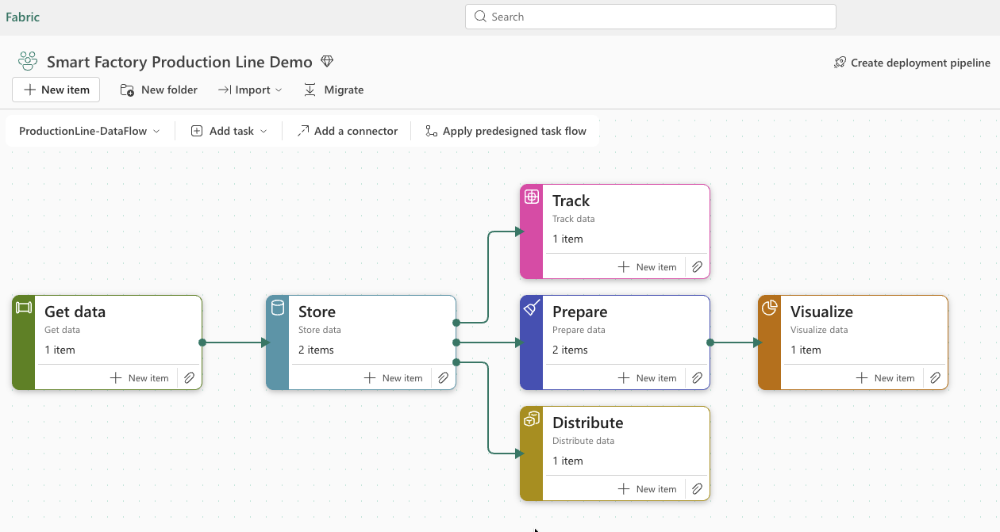
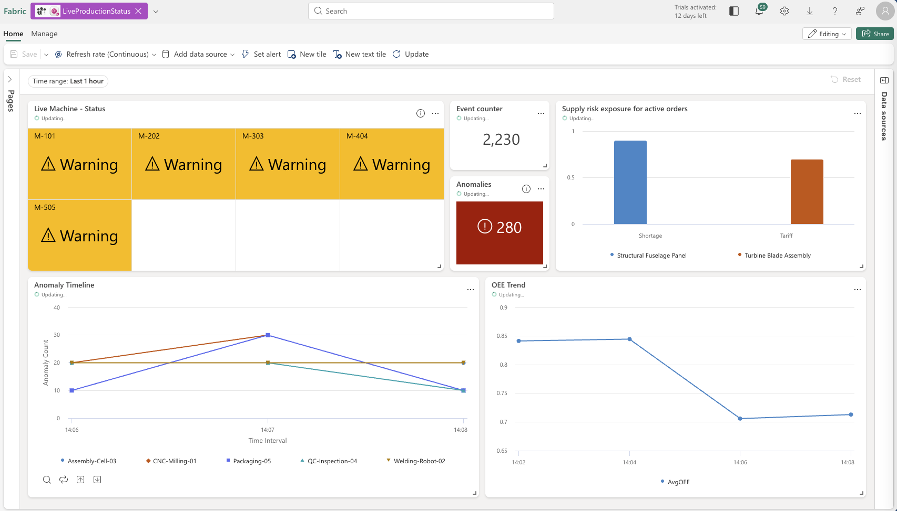

# Fabric Demo — Smart Factory

An end-to-end Microsoft Fabric demo built around a smart manufacturing scenario. This repository contains everything you need to stand up a live Fabric demo — from streaming data generation to real-time dashboards, Power BI reports, and an AI agent.



## Scenario

A virtual aerospace factory receives customer orders and processes them through a 5-station production line. The factory streams real-time telemetry (temperature, vibration, pressure, cycle times), assembly milestones, and production KPIs into Microsoft Fabric via Eventstream. Anomalies are injected at an 8% rate to create realistic alerting and investigation scenarios.

```
SmartFactorySimulator (C#)
         ↓
    Eventstream (Custom App Source)
         ↓
    ├─→ Eventhouse / KQL Database (Real-Time Analytics)
    ├─→ Real-Time Dashboard
    ├─→ Power BI Report
    ├─→ AI Agent (Fabric Agent Builder)
    └─→ Data Activator (Alerting)
```

## What's in This Repo

| Path | Description |
|------|-------------|
| [SmartFactorySimulator/](SmartFactorySimulator/) | C# data seeder that generates streaming factory telemetry and sends it to Fabric Eventstream |
| [HowToSetup.md](HowToSetup.md) | Step-by-step guide to provision the full Fabric environment (Eventhouse, Eventstream, dashboards, Power BI, Agent) |

## Quick Start

### 1. Set up the Fabric environment

Follow the [How To Setup Guide](HowToSetup.md) to create your workspace, Eventhouse, tables, Eventstream, dashboards, and agent. The guide covers 13 steps from workspace creation through Data Activator alerts.

### 2. Configure and run the simulator

```bash
cd SmartFactorySimulator
cp appsettings.example.json appsettings.json
# Edit appsettings.json with your Eventstream connection string and entity path
dotnet build
dotnet run -- 5   # Run 5 parallel factory sessions
```

See the [Smart Factory Simulator README](SmartFactorySimulator/README.md) for full usage, configuration options, and event schemas.

### 3. Present the demo

Once data is flowing, you have a complete demo environment:

- **Real-Time Dashboard** — Live machine status, anomaly timeline, OEE trend
- **Power BI Report** — OEE gauge, throughput by station, scrap rate trend, assembly funnel
- **AI Agent** — Conversational control tower for order status, anomalies, and supply chain risk
- **Data Activator** — Automated alerts on vibration spikes



## Prerequisites

- **.NET 9.0 SDK** or later
- **Microsoft Fabric** workspace (with capacity or trial)
- A Fabric **Eventstream** with Custom App source configured

## Demo Scope

| Fabric Capability | How It's Used |
|---|---|
| **Eventstream** | Ingests streaming events from the simulator via Event Hubs protocol |
| **Eventhouse (KQL Database)** | Stores and routes events using update policies; powers real-time queries |
| **Real-Time Dashboard** | Live tiles for machine status, anomalies, OEE, supply risk, event counts |
| **Power BI** | Performance management report with OEE gauge, cycle time analysis, scrap trends |
| **Agent Builder** | AI-powered control tower assistant that queries KQL to answer questions about orders, anomalies, and risk |
| **Data Activator** | Automated alerting on anomaly conditions (vibration > threshold) |

## Security

> **Important**: Never commit `appsettings.json` to version control. It contains your Event Hub connection strings and should remain local only. The `.gitignore` is configured to exclude it automatically.

## License

This project is licensed under the MIT License. See [LICENSE](LICENSE) for details.
